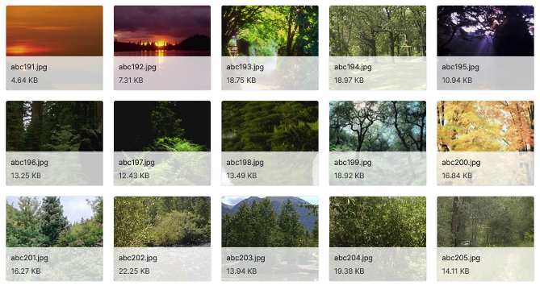
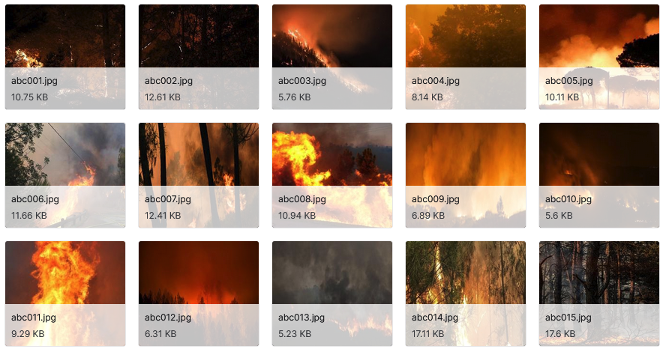

  

# Wildfire Detection
This dataset1 contains 250x250-pixel images depicting *normal* scenes and those containing fires. Below are some examples of these images:

The data can be used to build and train an ML model that can detect wildfires using image recognition. 

# Structure
This repo has the following structure:
* **model.json**: model file that you can load into PerceptiLabs (requires PerceptiLabs 0.12.0 or higher)
* **/Forest Fire**: contains the following:
    * **/data**: directory containing images of scenes
    * **data.csv**: CSV file that maps images to two classifications: **fire** and **no_fire**. This file can be used to import the data into PerceptiLabs when creating a model from scratch. The following shows a partial example of the CSV file:

| image | label |
| ----------------------- | ------ |
| ./data/fire (1).jpg | fire |
| ./data/nofire (152).jpg | no_fire |

# Community

Got questions, feedback, or want to join a community of machine learning practitioners working with exciting tools and projects? Check out our [Community](https://forum.perceptilabs.com/)!

1 Dataset Credits: Baris Dincer (2021), Wildfire Detection Image Data For Machine Learning Process, Kaggle, V1, https://www.kaggle.com/brsdincer/wildfire-detection-image-data, Database Contents License (DbCL) v1.0
